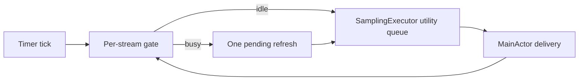

# Design: Performance Hardening

Status: draft
Spec: spec-performance-hardening.md

## Architecture Overview

Recommendation: profile first, then add a per-stream coalescing gate only if a backlog is observed. This preserves the existing `SamplingExecutor` model and avoids reopening the rejected filesystem-watcher work.

Alternatives considered:

1. Add coalescing now: fast, but speculative. Rejected.
2. Profile then add a bounded per-stream gate: minimal behavioral surface. Selected.
3. Replace the shared serial queue with parallel queues: reduces head-of-line blocking but creates reader-confinement and energy risks. Deferred unless evidence remains after option 2.

## Code Reuse Analysis

| Component | Location | Use |
| --- | --- | --- |
| Shared serial executor | `MacMetricsView/Services/MainRunLoopTimer.swift` | Keep its queue ownership and main-actor delivery contract. |
| Injectable poll schedulers | `*Sampler.swift` | Drive deterministic blocked-reader tests. |
| `isRunning` delivery guards | `DiskSampler.swift`, `GPUSampler.swift` | Apply same late-delivery rule consistently. |
| Release inputs | `MacMetricsView/Info.plist`, `docs/appcast.xml`, `README.md` | Verify existing metadata; do not duplicate it. |

## Components

### Per-stream coalescing gate

- **Purpose**: Own `idle`, `inFlight`, and `pending` state for one heavy reader.
- **Location**: `MacMetricsView/Services/MainRunLoopTimer.swift` unless implementation shows a smaller existing owner.
- **Interfaces**: starts work when idle; records exactly one pending request when busy; rechecks active generation before delivery.
- **Dependencies**: `SamplingExecutor`; no persistence; no UI types.
- **Reuses**: shared utility queue and sampler lifecycle guards.

### Sampling evidence harness

- **Purpose**: Prove or reject queue backlog using a blocked injected read; record result in the validation artifact.
- **Location**: `MacMetricsViewTests/` plus `docs/ai/validation/` when executed.
- **Interfaces**: test-only counters for started, queued, skipped, pending, and delivered work.
- **Dependencies**: existing fake schedulers and `InlineSamplingExecutor`-style seams.

### Local release gate

- **Purpose**: Read-only verification of bundle, signature, plist, and newest local appcast item.
- **Location**: `scripts/verify-release.sh`.
- **Interfaces**: `scripts/verify-release.sh <app-path> <appcast-path>`.
- **Dependencies**: `plutil`, `codesign`, standard shell tools; no network access.
- **Reuses**: current release runbook and appcast schema.

## Data Models

No persisted model changes. Runtime gate state contains only an active generation and one pending flag per stream.

## Error Handling Strategy

| Scenario | Handling | User Impact |
| --- | --- | --- |
| Stopped sampler completes | Drop delivery by generation/active guard. | No stale metric appears. |
| Repeated timer ticks during slow read | Set one pending flag; do not enqueue more work. | Latest data catches up after read. |
| No measured backlog | Stop before sampler integration. | No production scheduling change. |
| Invalid release input | Script exits non-zero before any mutation. | Maintainer gets actionable error. |

## Risks & Concerns

| Concern | Location | Impact | Mitigation |
| --- | --- | --- | --- |
| All heavy readers share one serial queue. | `MainRunLoopTimer.swift:57` | Slow I/O can delay later readers. | Measure first; use bounded per-stream work before considering queue topology. |
| Open popover schedules token readers every second. | `AppDelegate.swift:322` | More opportunities to enqueue duplicate reads. | Controlled slow-reader test and conditional coalescing. |
| Filesystem watcher was already rejected after measurement. | `validation-lightweight-performance.md` | Repeating work wastes time and may change timing. | Keep it out of scope without new profiling evidence. |
| Release has SPM and Xcode paths. | `Package.swift`, `MacMetricsView.xcodeproj` | One path can drift silently. | Local gate verifies Xcode bundle and metadata; `swift test` remains required. |

## Tech Decisions

| Decision | Choice | Rationale |
| --- | --- | --- |
| Scheduling change | Evidence-gated coalescing | Current backlog is plausible but unproven. |
| Queue topology | Keep shared serial queue initially | Preserves reader state confinement and minimizes blast radius. |
| Token file monitoring | Keep polling | Existing project measurement rejected watcher ROI. |
| Release automation | Local script only | Project explicitly has no CI/CD. |
