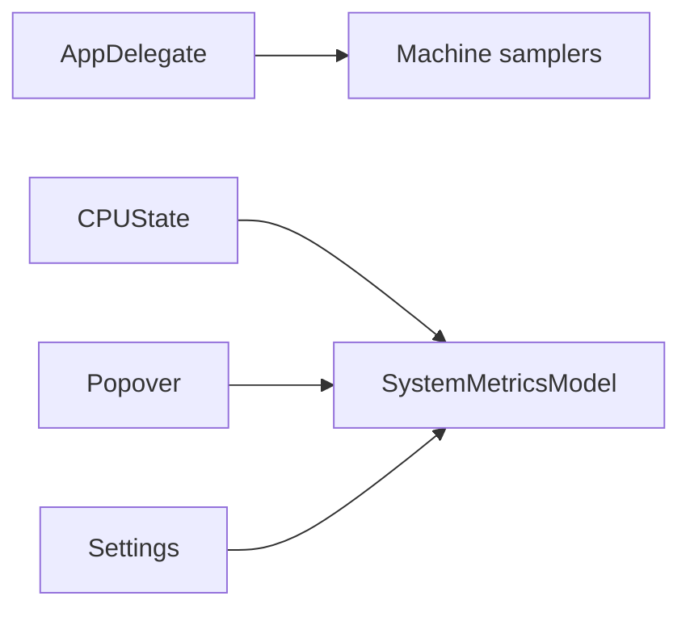

# Design: Remove Token Usage

Status: ready
Spec: spec-remove-token-usage.md

## Architecture

Delete the token pillar at its boundaries first, then remove its isolated implementation files and Xcode references. No compatibility shim remains because no current feature consumes token state.

## Component Removal

| Area | Files / surface | Action |
| --- | --- | --- |
| Runtime wiring | `AppDelegate`, `CPUState`, `PopoverView`, `StatusItemController` | Remove token state, samplers, callbacks, title composition, and refresh lifecycle. |
| Presentation | `MetricsTab`, `SettingsTab`, `PopoverTabPresentation`, localization | Remove token card, detail rows, controls, labels, and enum entry. |
| Token implementation | `TokenUsageModel`, token models, readers, samplers, formatters, pricing, backfill | Delete production files. |
| Tests | `*Token*`, Claude/Codex readers, mixed token tests | Delete token-only tests; update machine-only assertions. |
| Build/docs | Xcode project, README, PRD, project context, technical decision | Remove build references and current claims. |

## Data Lifecycle

No migration runs. Existing token keys remain in `UserDefaults` but production code no longer references them. External logs and AI tool configuration are not touched.

## Risks & Concerns

| Concern | Location | Impact | Mitigation |
| --- | --- | --- | --- |
| Token state is shared with application coordination. | `MacMetricsView/App/AppDelegate.swift`, `MacMetricsView/App/CPUState.swift` | Compile errors or stale lifecycle calls. | Remove wiring before deleting source files; test app-facing state. |
| Xcode explicitly lists token files. | `MacMetricsView.xcodeproj/project.pbxproj` | Xcode build fails after source deletion. | Remove every token build-file and file-reference entry. |
| Historical docs contain token claims. | `docs/ai/validation/`, `docs/ai/tasks/` | Audit history could be damaged. | Update only current product docs and add a new removal record. |

## Decisions

| Decision | Choice | Rationale |
| --- | --- | --- |
| Compatibility | No token API shim | The feature is fully removed, not deprecated. |
| Persisted data | Leave token keys inert | Avoid destructive cleanup and migration complexity. |
| Test removal | Delete token-only tests | Their behavior is intentionally gone; retain machine-only coverage. |
